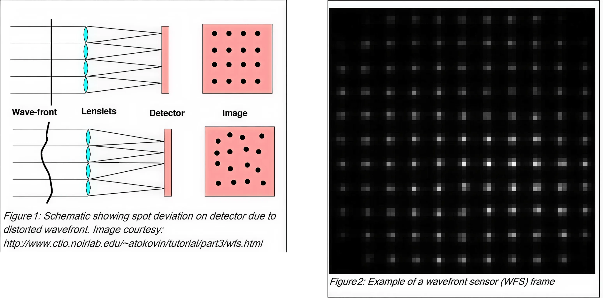

# BAH 2026 — Challenge 9: Wavefront Reconstruction & Turbulence Characterization

**Webapp** [SH-WFS Pipeline](https://adaptive-optics.onrender.com)  
**Hackathon:** Bharatiya Antariksh Hackathon 2026 (organized by ISRO)
---

## Overview


This repository contains the solution development for **Challenge Problem Statement 9** of BAH 2026:

> *Developing and Optimizing Algorithms for Wavefront Reconstruction and Turbulence Characterization Using Shack-Hartmann Wavefront Sensor (SH-WFS) Time-Series Data*

The goal is to process SH-WFS frames (BMP images captured at millisecond intervals) to:

- Reconstruct **wavefront phase maps** $W(x_i, y_i)$ from spot-field centroid deviations
- Characterize atmospheric turbulence via the **Fried parameter** ($r_0$) and **coherence time** ($\tau_0$)
- Derive **deformable mirror (DM) actuator maps** $A(x_i, y_i)$ that compensate for inter-actuator mechanical coupling
- Achieve all processing within **<10 ms per frame** for real-time adaptive optics correction

---

## Repository Structure

```
bah2026/
├── PROBLEM.md                         # Official problem statement (Challenge 9)
├── SOLUTION.md                        # Full mathematical solution & C implementation design
├── README.md                          # This file
├── challenge-9-flow-diagram.webp      # Pictorial overview of the problem
└── Resources/
    ├── README.md                      # Brief note about reference papers
    ├── frequency-response-optimized-shack-hartmann.pdf
    ├── SC15D026 FT.pdf
    ├── Deep learning wavefront sensing method for Shack-Hartmann
    │   sensors with sparse sub-apertures.pdf
    ├── Data driven branch-point identification.pdf
    ├── Neural network algorithm for under-sampled.pdf
    ├── PINN_Architecture.pdf
    └── photonics-10-00065-v2.pdf
     
```

---

## Files Explained

| File | Description |
|------|-------------|
| `PROBLEM.md` | The official challenge statement — problem description, objectives, expected outcomes, data requirements, evaluation criteria. Start here to understand *what* needs to be built. |
| `SOLUTION.md` | Comprehensive, mathematically rigorous solution design covering all five stages of the pipeline: centroiding, modal/zonal wavefront reconstruction, turbulence statistics, actuator coupling inversion, and a C implementation blueprint using BLAS. |
| `challenge-9-flow-diagram.webp` | Visual overview of the SH-WFS data flow from raw frames → centroids → wavefront → actuator commands. |
| `Resources/` | Collection of academic reference papers on Shack-Hartmann wavefront sensing, adaptive optics, deep learning approaches, and related topics. |

---

## Solution Pipeline (from `SOLUTION.md`)

The proposed solution follows a five-stage processing chain:

### 1. High-Speed Sub-Pixel Centroiding
Dynamic background thresholding + Center-of-Mass calculation to extract spot centroids at sub-pixel precision from each SH-WFS frame.

### 2. Wavefront Reconstruction
Two parallel reconstruction strategies:
- **Modal** — Zernike polynomial expansion via pseudo-inverse of the interaction matrix $G$
- **Zonal** — Fried geometry finite-difference phase recovery via sparse matrix inversion

### 3. Turbulence Characterization
- **Fried parameter $r_0$** — from Noll's residual variance of tip-tilt Zernike modes
- **Coherence time $\tau_0$** — from temporal autocorrelation decay ($1/e$ threshold) of dominant modes

### 4. Actuator Map Inversion
Inversion of the inter-actuator coupling (influence) matrix $H$ to produce decoupled DM stroke commands: $\mathbf{u} = H^{-1} (-\boldsymbol{\phi})$

### 5. Optimized C Control Engine
Locked-loop pipeline using BLAS `cblas_dgemv` for matrix-vector multiplication, with all static matrices pre-computed offline to avoid runtime allocations.

---

## Tech Stack (Planned)

- **Language:** C (low-level, performance-critical)
- **Libraries:** BLAS (`cblas.h`) for optimized linear algebra
- **Build system:** Not yet configured (Makefile recommended)

---

## Getting Started

1. **Read the problem:** Start with `PROBLEM.md` to understand the challenge requirements.
2. **Study the solution:** `SOLUTION.md` provides the full mathematical framework and C engine design.
3. **Review references:** The `Resources/` folder contains relevant academic papers for deeper dives into specific techniques.
4. **Data:** Actual SH-WFS BMP frame datasets and MLA/DM calibration parameters are expected to be provided separately by the hackathon organizers.

---

## Development Status

The repository is currently in the **documentation and theoretical design phase**. No source code has been implemented yet. Contributions and development will follow the roadmap outlined below.

### Planned Roadmap

- [ ] Implement BMP frame I/O and structured data handling
- [ ] Build centroiding engine (dynamic thresholding + CoM)
- [ ] Implement Zernike modal reconstruction
- [ ] Implement Fried zonal reconstruction
- [ ] Build turbulence statistics module ($r_0$, $\tau_0$)
- [ ] Implement DM actuator map inversion with coupling
- [ ] Design C pipeline with BLAS integration
- [ ] Profile and optimize for <10 ms frame budget
- [ ] Write tests and validation against synthetic data

---

## References

Key academic papers included in `Resources/`:

- Deep learning wavefront sensing for SH-WFS with sparse sub-apertures (*Optics Express*)
- Frequency-response-optimized Shack-Hartmann sensors
- Data-driven branch-point identification
- Neural network algorithms for under-sampled wavefront sensing
- Photonics-based wavefront sensing techniques
- SC15D026 FT (related technical report)

---

## License

This project is developed as part of **Bharatiya Antariksh Hackathon 2026**. All rights belong to the respective authors and organizers.

---
